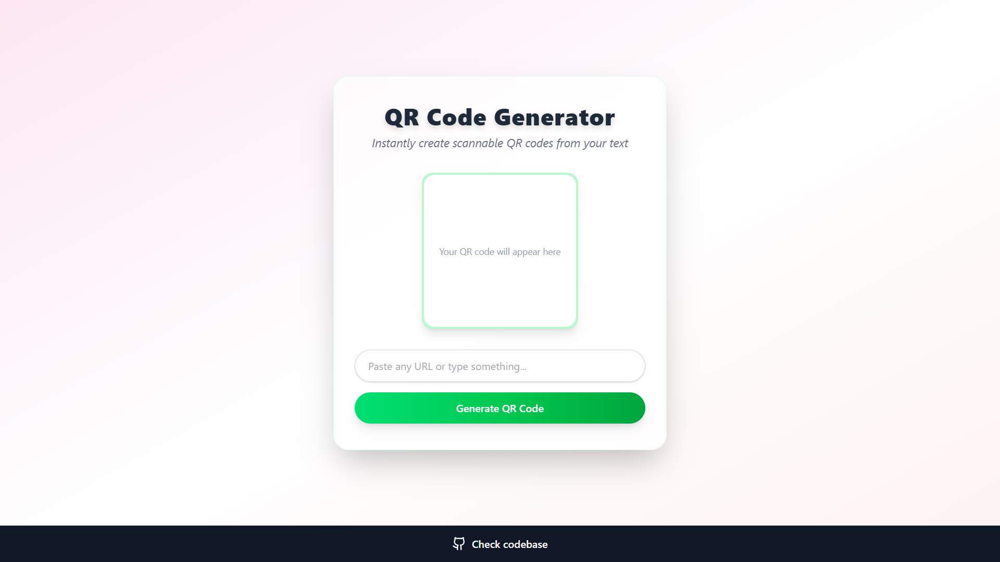

# QR Code Generator

A modern, responsive web app to instantly generate scannable QR codes from any text or URL. Built with React, Vite, Tailwind CSS, and the qrcode library.

## Features

- Instantly generate QR codes from any text or URL
- Mobile-friendly and responsive design
- Beautiful UI
- Input validation and user feedback
- Scan QR codes directly on your phone

### [Check it out live here: 👈](./src/assets/qr-code.png)

## Tech Stack
- React
- Vite
- Tailwind CSS
- qrcode library
- react-hot-toast library

## Contributors:

## Contact:

_For any questions or feedback, please contact:_

**Ravikant Tarare**

📩 [ravikanttarare2001@gmail.com](mailto:ravikanttarare2001@gmail.com)

📞 [8275957698](tel:8275957698)
